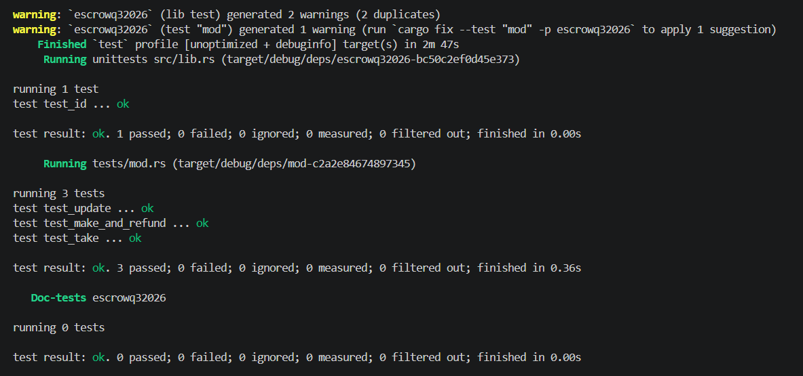

# Solana Escrow Program

A trustless, atomic token swap program built on Solana using the Anchor framework and `anchor-spl` token interfaces (supporting both SPL Token and Token-2022 standards).

---

## Overview

The Escrow program allows two parties—a **Maker** and a **Taker**—to execute bidirectional token exchanges without intermediaries or mutual trust.

1. **Maker** deposits Token A into a Program Derived Address (PDA) vault, specifies the desired amount of Token B (`receive`), and sets an expiration timestamp.
2. **Taker** deposits Token B directly to the Maker's Associated Token Account (ATA) to claim Token A from the vault atomically.
3. If no counterparty accepts the offer or if terms change, the **Maker** can update the expiration or cancel the escrow via refund, retrieving all deposited tokens and closing accounts to reclaim rent.

---

## Program Details

- **Program ID**: `FtJVZ3vupN4vkUXsdBafqEhy3ACWCGKkQmmegL6krtdC`
- **Framework**: Anchor (Rust)
- **Token Support**: SPL Token & SPL Token-2022 (`TokenInterface`, `transfer_checked`)

---

## Account Architecture & State

### 1. Escrow State (`Escrow`)

The escrow state account holds the parameters and configuration of the swap.

| Field | Type | Description |
| :--- | :--- | :--- |
| `seed` | `u64` | Maker-defined entropy seed allowing multiple concurrent escrows per maker |
| `maker` | `Pubkey` | Public key of the escrow creator |
| `mint_a` | `Pubkey` | Mint address of the token being deposited by Maker |
| `mint_b` | `Pubkey` | Mint address of the token expected in return from Taker |
| `receive` | `u64` | Exact amount of Token B required to settle the trade |
| `bump` | `u8` | Bump seed used for PDA validation and signer seeds |
| `expiration` | `i64` | Unix timestamp after which the escrow cannot be taken or modified |

### 2. PDA Derivation

- **Escrow State PDA**:
  ```text
  seeds = [b"escrow", maker_pubkey.as_ref(), seed.to_le_bytes().as_ref()]
  ```
- **Vault Token Account**:
  Associated Token Account for `mint_a` owned by the `Escrow` PDA:
  ```text
  authority = escrow_pda
  mint = mint_a
  ```

---

## Instructions

### 1. `make`

Initializes the escrow state account and transfers `deposit` amount of Token A from Maker's ATA into the PDA-owned vault.

- **Parameters**: `seed: u64`, `deposit: u64`, `receive: u64`, `expiration: i64`
- **Signer**: Maker

### 2. `take`

Atomically settles the exchange between Maker and Taker:
1. Transfers `receive` amount of Token B from Taker's ATA to Maker's ATA (`init_if_needed`).
2. Transfers all deposited Token A from the Vault to Taker's ATA (`init_if_needed`) signed by the Escrow PDA.
3. Closes the Vault token account and transfers reclaimed rent to Maker.
4. Closes the Escrow state account and transfers reclaimed rent to Maker.

- **Parameters**: None
- **Signer**: Taker

### 3. `refund`

Cancels an active escrow and returns deposited assets:
1. Transfers Token A from the Vault back to Maker's ATA signed by the Escrow PDA.
2. Closes the Vault token account (rent returned to Maker).
3. Closes the Escrow state account (rent returned to Maker).

- **Parameters**: None
- **Signer**: Maker

### 4. `update`

Allows Maker to update the escrow expiration timestamp prior to expiration.

- **Parameters**: `expiration: i64`
- **Signer**: Maker
- **Constraints**: Validates that current expiration has not elapsed and new expiration timestamp is strictly in the future.

---

## Project Structure

```text
escrow-q3-26/
├── Anchor.toml
├── Cargo.toml
├── programs/
│   └── escrowq32026/
│       ├── Cargo.toml
│       ├── src/
│       │   ├── lib.rs              # Program entrypoint and instruction handlers
│       │   ├── state.rs            # Escrow account struct definition
│       │   ├── constants.rs        # PDA seed definitions
│       │   ├── error.rs            # Custom error enum
│       │   ├── instructions/
│       │   │   ├── mod.rs
│       │   │   ├── make.rs         # Escrow initialization and vault deposit
│       │   │   ├── take.rs         # Atomic trade settlement and account closing
│       │   │   ├── refund.rs       # Escrow cancellation and refund
│       │   │   └── update.rs       # Expiration timestamp update
│       │   └── instructions.rs
│       └── tests/
│           └── mod.rs              # LiteSVM integration test suite
├── arch/                           # Architecture flow diagrams
│   ├── make.png
│   ├── take.png
│   └── refund.png
└── proof/
    └── image.png                   # LiteSVM test verification output
```

---

## Building and Testing

### Prerequisites

- Rust `1.75.0+`
- Solana CLI `1.18+`
- Anchor CLI `0.30.1`

### Build

```bash
anchor build
```

### Test

Unit and integration tests are implemented using `litesvm` and `litesvm-token` for fast in-process SVM verification without running a local validator.

```bash
cargo test --package escrowq32026
```

### Test Coverage

- `test_make_and_refund`: Tests escrow initialization, vault deposit balance, refund execution, and account closure.
- `test_take`: Tests atomic trade settlement, dual ATA creation (`init_if_needed`), balance verification, and rent recovery.
- `test_update`: Tests expiration updates and rejects past timestamps.

---

## Execution & Test Proof

Integration tests executed successfully against the program binary via LiteSVM:


